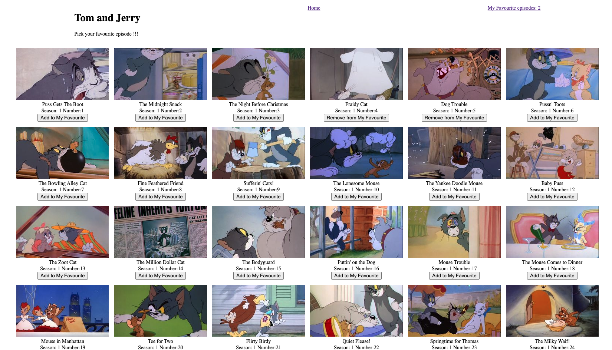

  

How to use it ?

# git clone https://github.com/Zowie0122/tom-jerry_episodes_collection.git

# yarn

# yarn start

# Knowledge

npx create-react-app your-app-name
yarn add typescript @types/node @types/react @types/react-dom
App.js 👉 App.tsx
index.js 👉 index.tsx
yarn start

react-context explanation
Share state within a component tree:
central storage of data for front-end so that components can pass data easlier between each other. Similiar with Redux.

create Store.tsx
import and add <StoreProvider> to index.tsx
import Store to the components that needs to access the data in React-context

create interface.ts
declear all the interfaces for typescript

React.lazy and React.Suspense
